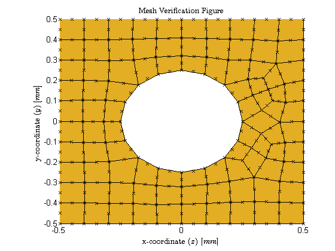

# ah_fem: A finite element code for the solution of Steady State Heat Conduction
Alex Hagen

## Contents

1.  Introduction
2.  Usage
3.  Discussion and Report
4.  Improvement and To-Do

## Introduction

### Motivation

This code, in its MATLAB form and particular meshes, is developed as a deliverable for a Purdue ME 681 Project.  Past that, though, this code is developed to solve the heat conduction equation in two dimensions.  It uses an 8 noded quadrilateral serendipity to solve with several different geometric setups.  To develop these meshes, ABAQUS is used to create input files, and a MATLAB routine is used to solve for the temperature throughout the defined geometry.

### Tasks

- Solve one dimensionally
- Solve two dimensionally
- Solve two dimensionally with a hole inside a square region.

## Usage

Follow the below steps to use the code:

-

```matlab

x = [ 5 5 5 5 ];

```

## Procedure

1. Mesh Creation
  1.  Use Abaqus to create meshes and export to `*.inp` files
    1. Square Region with Dirichlet only boundary conditions
      * Moderate Quadrilateral Mesh Density ( [`sq_quad_mod_dirbc.inp`](inp/sq_quad_mod_dirbc.inp) )
      * Moderate Triangular Mesh Density ( [`sq_tri_mod_dirbc.inp`](inp/sq_tri_mod_dirbc.inp) )
    2. Square Region with Dirichlet and Neumann boundary conditions
      * Low Mesh Quadrilateral Density ( [`sq_quad_low_dirneubc.inp`](inp/sq_quad_low_dirneubc.inp) )
      * Low Mesh Triangular Density ( [`sq_tri_low_dirneubc.inp`](inp/sq_tri_low_dirneubc.inp) )
      * Moderate Quadrilateral Mesh Density ( [`sq_quad_mod_dirneubc.inp`](inp/sq_quad_mod_dirneubc.inp) )
      * Moderate Triangular Mesh Density ( [`sq_tri_mod_dirneubc.inp`](inp/sq_tri_mod_dirneubc.inp) )
      * High Quadrilateral Mesh Density ( [`sq_quad_high_dirneubc.inp`](inp/sq_quad_high_dirneubc.inp) )
      * High Triangular Mesh Density ( [`sq_tri_high_dirneubc.inp`](inp/sq_tri_high_dirneubc.inp) )
    3. Square Region with Hole
      * Low Mesh Quadrilateral Density ( [`sqhole_quad_low_dirneubc.inp`](inp/sqhole_quad_low_dirneubc.inp) )
      * Low Mesh Triangular Density ( [`sqhole_tri_low_dirneubc.inp`](inp/sqhole_tri_low_dirneubc.inp) )
      * Moderate Quadrilateral Mesh Density ( [`sqhole_quad_mod_dirneubc.inp`](inp/sqhole_quad_mod_dirneubc.inp) )
      * Moderate Triangular Mesh Density ( [`sqhole_tri_mod_dirneubc.inp`](inp/sqhole_tri_mod_dirneubc.inp) )
      * High Quadrilateral Mesh Density ( [`sqhole_quad_high_dirneubc.inp`](inp/sqhole_quad_high_dirneubc.inp) )
      * High Triangular Mesh Density ( [`sqhole_tri_high_dirneubc.inp`](inp/sqhole_tri_high_dirneubc.inp) )
  2.  Importing the mesh element structure and their correlation to the global locations ( [`import_mesh.m`](import_mesh.m))
  	1.  Creation of a `struct` for the elements which has the following layout:

  	```
	                         +--------+                                       
	                         |  mesh  |                                       
	     +-------------------+--+---+-+                                       
	     |                      |   |                                         
	     |                      |   |                                         
	+----+----+   +--------+----+   +---+-------------------+                 
	| n_nodes |   |  n_el  |            |  elements(1:n_el) |                 
	+---------+   +--------+            +-------+-----------+                 
	                                            |                             
	                                            |                             
	                                            |   +-------+                 
	                                            +---+ el_no |                 
	                                            |   +-------+                 
	                                            |   +----------+              
	                                            +---+ el_type  |              
	                                            |   +----------+              
	                                            |   +---------+               
	                                            +---+ n_nodes |               
	                                            |   +---------+               
	                                            |   +---------------------+   
	                                            +---+ local_corner_xi,eta |   
	                                            |   +---------------------+   
	                                            |   +----------------------+  
	                                            +---+ local_midside_xi,eta |  
	                                            |   +----------------------+  
	                                            |   +-----------------------+ 
	                                            +---+ global_corner_node_no | 
	                                            |   +-----------------------+ 
	                                            |   +------------------------+
	                                            +---+ global_midside_node_no |
	                                            |   +------------------------+
	                                            |   +-------------------+     
	                                            +---+ global_corner_x,y |     
	                                            |   +-------------------+     
	                                            |   +--------------------+    
	                                            +---+ global_midside_x,y |    
	                                                +--------------------+    
```

	2. Import of values for each element into the structure array using `readinp.m`
	3. Plotting of the mesh for visual confirmation of correct import
	
  3.  Importing the boundary and body conditions and where they are applied throughout the model
  	1. Creation of a `struct` for the boundary conditions which has the following layout:

  	```
	                +-----+                               
	                | bcf |                               
	                +--+--+                               
	                   |                                  
	      +------------+--------------+                   
	      |                           |                   
	+-----+----+                +-----+------+            
	| f(1:n_f) |                | bc(1:n_bc) |            
	+--+-------+                +--+---------+            
	   |                           |                      
	   |     +------+              |      +------+        
	   +-----+ name |              +------+ name |        
	   |     +-----++              |      +-----++        
	   |     +-----+               |      +-----+         
	   +-----+ set |               +------+ set |         
	   |     +-----+               |      +-----+         
	   |     +-----+----+          |      +-----+         
	   +-----+ elements |          +------+ |al |         
	   |     +-------+--+          |      +-----+         
	   |     +-------+             |      +-----+--------+
	   +-----+ |alue |             +------+ global_nodes |
	         +-+-----+                    +--------------+
  	```

  	2. Import of values for the boundary conditions and source conditions using `readinp.m`
  	3. Plotting of b.c. on top of previous mesh figure for visual confirmation of correct import
  	
2. Creation of the stiffness matrix for each element
  1. something
  2. something
3. Creation of the forcing vectors for each element
  1. something
  2. something
4. Assembly of the elemental matrices and vectors into the global stiffness matrix and forcing vectors
  1. something
  2. something
5. Solution of the global temperatures using MATLAB's backdivision operator (`T = K_global\f_global`)
6. Calculation of the x and y derivatives of the global temperature distribution
7. Calculation of the flux at each point from the derivatives
8. Comparison to exact solution
9. Plotting of requested plots ( [`plot_t_qpp.m`](plot_t_qpp.m) )
  1. 
  2. 


## Discussion and Report

### Discussion

Discussion can be found in [inp/](something)

## Improvement and To-Do

- [ ] Port to Python to allow for open-source development
- [ ] continued to-dos