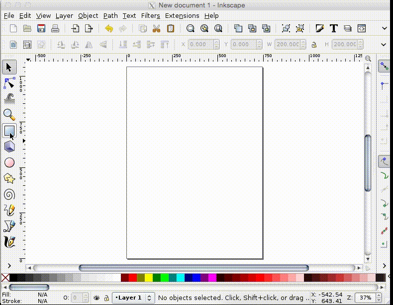

# How To

## 2-Dimensional Scalar Problem (Heat Conduction)

### 1. Creation of Geometry (Square with Hole)

Using your favorite svg editor (mine is Inkscape), create a square with a hole (side length 2, hole radius 0.5) and fill it with black.  Be sure that it is defined as a path and that the hole and square have been combined.  The following gif gives the process for Inkscape.



Save this as a (plain) svg.  The file should look like this:

```svg

<?xml version="1.0" encoding="UTF-8" standalone="no"?>
<!-- Created with Inkscape (http://www.inkscape.org/) -->

<svg
   xmlns:dc="http://purl.org/dc/elements/1.1/"
   xmlns:cc="http://creativecommons.org/ns#"
   xmlns:rdf="http://www.w3.org/1999/02/22-rdf-syntax-ns#"
   xmlns:svg="http://www.w3.org/2000/svg"
   xmlns="http://www.w3.org/2000/svg"
   version="1.1"
   width="200"
   height="200"
   id="svg2">
  <defs
     id="defs4" />
  <metadata
     id="metadata7">
    <rdf:RDF>
      <cc:Work
         rdf:about="">
        <dc:format>image/svg+xml</dc:format>
        <dc:type
           rdf:resource="http://purl.org/dc/dcmitype/StillImage" />
        <dc:title></dc:title>
      </cc:Work>
    </rdf:RDF>
  </metadata>
  <g
     transform="translate(0,-852.375)"
     id="layer1">
    <path
       d="m 0,852.375 0,200 200,0 0,-200 -200,0 z m 100,50 c 27.61424,0 50,22.38576 50,50 0,27.61424 -22.38576,50 -50,50 -27.614237,0 -50,-22.38576 -50,-50 0,-27.61424 22.385763,-50 50,-50 z"
       id="rect3763"
       style="fill:#000000;fill-opacity:1;stroke:none" />
  </g>
</svg>

```